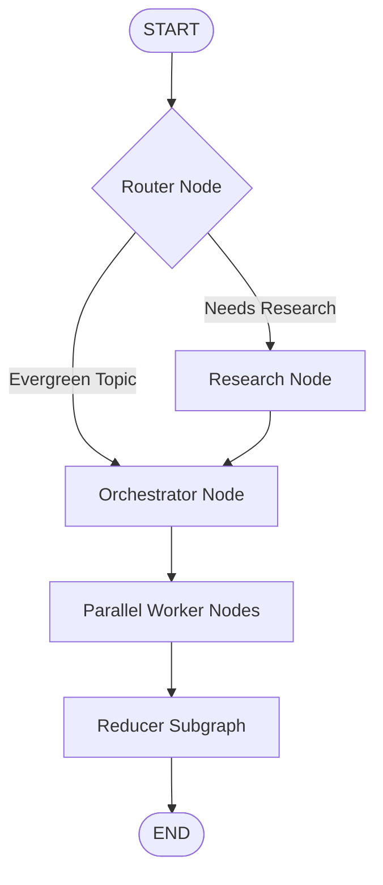

# AI Blog Studio 🚀

AI Blog Studio is a full-stack, AI-powered blogging platform that plans, researches, drafts, and compiles high-quality technical blog articles. By leveraging a multi-agent orchestration architecture built on top of **FastAPI**, **LangGraph**, and **React/Vite**, the application automates the entire writing workflow—from raw topic input to polished Markdown files complete with AI-generated diagrams and images.

---

## 🏗️ Project Architecture

The project is structured into two main components:

1. **BACKEND (FastAPI & LangGraph)**:
   - Orchestrates an agentic workflow using **LangGraph** (Router ➔ Research ➔ Orchestrator ➔ Parallel Workers ➔ Reducer).
   - Utilizes **OpenRouter** (defaulting to Qwen 235B) for language model capabilities.
   - Leverages **Tavily API** to conduct real-time web research for up-to-date and open-book topics.
   - Integrates with an image generation API to automatically generate and embed visuals.
   - Saves final blog posts as structured Markdown files.

2. **FRONTEND (React & Vite)**:
   - Responsive single-page application built with React (v19) and Lucide Icons.
   - Allows users to customize target audience, tone, generation date (`as_of`), research modes, and code/image inclusion.
   - Real-time markdown preview rendering.
   - Export capabilities to **PDF** and **DOCX** formats.

---

## 📂 Repository Structure

```text
BLOG/
├── BACKEND/                    # FastAPI python backend
│   ├── bwa_backend.py          # Main application file & LangGraph flow
│   ├── test_openrouter_direct.py # Script to test OpenRouter connectivity
│   ├── .env                    # Backend environment variables
│   ├── images/                 # Generated images/diagrams repository
│   └── *.md                    # Generated blog posts (markdown format)
│
├── FRONTEND/                   # React frontend
│   ├── src/                    # Frontend source files (App.jsx, styles.css)
│   ├── package.json            # Node dependencies and scripts
│   ├── vercel.json             # Deployment settings (Vercel)
│   ├── .env.example            # Template for frontend environment variables
│   └── index.html              # Entry HTML file
│
├── .gitignore                  # Global Git ignore configurations
└── README.md                   # Project documentation (this file)
```

---

## ⚡ LangGraph Workflow

The backend uses a multi-node agentic workflow to guarantee high-quality blog generation:



- **Router**: Determines if the topic is evergreen (closed_book), requires hybrid retrieval, or is news-based (open_book).
- **Research**: Queries Tavily for search results and filters relevant `EvidenceItems`.
- **Orchestrator**: Defines a blog plan consisting of 5-9 tasks, target word counts, and outlines.
- **Workers**: Generate content in parallel for each planned task.
- **Reducer Subgraph**: Merges content, decides where to place images, invokes image generation, and writes the final markdown file.

---

## 🛠️ Getting Started

### Prerequisites

- **Python 3.9+**
- **Node.js 18+ & npm**
- **API Keys**:
  - OpenRouter API Key (for LLM generation)
  - Tavily API Key (for web research)
  - AI Guru Lab API Key (for image generation)

---

### Backend Setup

1. Navigate to the `BACKEND` directory:
   ```bash
   cd BACKEND
   ```

2. Create and activate a Python virtual environment:
   ```bash
   # Windows
   python -m venv .venv
   .venv\Scripts\activate

   # macOS/Linux
   python3 -m venv .venv
   source .venv/bin/activate
   ```

3. Install the required Python dependencies:
   ```bash
   pip install fastapi uvicorn requests pydantic langgraph langchain-core python-dotenv langchain-community
   ```

4. Configure your backend environment variables by creating a `.env` file in the `BACKEND` folder:
   ```env
   OPENROUTER_API_KEY="your_openrouter_api_key"
   TAVILY_API_KEY="your_tavily_api_key"
   AIGURULAB_API_KEY="your_aigurulab_api_key"
   BACKEND_BASE_URL="http://127.0.0.1:8000"
   ```

5. Run the FastAPI server:
   ```bash
   uvicorn bwa_backend:api --reload
   ```
   The backend will be running at `http://127.0.0.1:8000`.

---

### Frontend Setup

1. Navigate to the `FRONTEND` directory:
   ```bash
   cd ../FRONTEND
   ```

2. Install the Node dependencies:
   ```bash
   npm install
   ```

3. Create your `.env` file from the template:
   ```bash
   cp .env.example .env
   ```
   *Ensure `VITE_API_BASE_URL` is set to your backend URL (e.g. `http://127.0.0.1:8000`).*

4. Launch the Vite development server:
   ```bash
   npm run dev
   ```
   The frontend will be running at `http://localhost:5173`.

---

## 🎨 Features & Usage

- **Topic Specification**: Type your subject (e.g., "Understanding the Constitution of India").
- **Research Control**: Override the routing behavior using options like `Auto`, `Closed book`, `Hybrid`, or `Open book`.
- **Custom Auditing**: Provide target audience instructions (e.g., developers, general audience) and specific tones.
- **Exporting**: Click the export dropdown to download your blog post as a styled **PDF** or formatted **DOCX** file.
